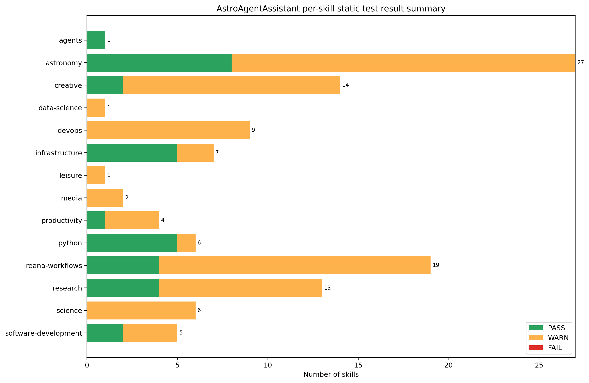

# AstroAgentAssistant Skill Test Report

Generated UTC: `2026-06-27T17:38:03Z`
Git commit: `fc01b35bffa30f7c05ed2cd10065292a4fc6f568`

## Summary

| Metric | Value |
|---|---:|
| Skills tested | 115 |
| Skill PASS | 32 |
| Skill WARN | 83 |
| Skill FAIL | 0 |
| Support files tested | 14 |
| Support PASS | 14 |
| Support FAIL | 0 |
| Serious secret hits | 0 |
| Root audit | PASS |

## Per-skill Results

| Skill | Category | Status | Issues | Quality notes |
|---|---|---:|---|---|
| `astroagent-concept` | `agents` | PASS | - | canonical_routing |
| `astro-catalog-plotting-cache` | `astronomy` | WARN | required_sections | canonical_routing |
| `astro-data-access-umbrella` | `astronomy` | WARN | required_sections | canonical_routing |
| `data-aip-de-s3` | `astronomy` | PASS | - | - |
| `gaia-aip-data-access` | `astronomy` | WARN | required_sections | canonical_routing |
| `gaia-aip-de-adql` | `astronomy` | PASS | - | - |
| `gaia-dr3-plot-with-dust` | `astronomy` | WARN | required_sections | license_present, canonical_routing |
| `gaia-dr3-tap-query` | `astronomy` | WARN | required_sections | license_present |
| `gaiadr3-aip-de-adql` | `astronomy` | PASS | - | - |
| `gaiadr3-aip-query-api` | `astronomy` | WARN | required_sections | author_present, license_present |
| `rave-dr6` | `astronomy` | PASS | - | - |
| `rave-dr6-3d-animation` | `astronomy` | WARN | required_sections | license_present |
| `rave-dr6-3d-public-animation` | `astronomy` | WARN | required_sections | author_present, license_present |
| `rave-dr6-data-access` | `astronomy` | WARN | required_sections | canonical_routing |
| `rave-dr6-nearest-100-plot` | `astronomy` | PASS | - | - |
| `rave-dr6-public-talk-visualizations` | `astronomy` | PASS | - | - |
| `rave-dr6-recent-observations-plot` | `astronomy` | WARN | required_sections | license_present |
| `rave-dr6-tap-query` | `astronomy` | WARN | required_sections | license_present |
| `s3-parquet-astro-access` | `astronomy` | WARN | required_sections | canonical_routing |
| `shboost-cmd-plot` | `astronomy` | WARN | required_sections | author_present, license_present |
| `shboost-cmd-visualization` | `astronomy` | WARN | required_sections | license_present |
| `shboost-plot-s3` | `astronomy` | WARN | required_sections | license_present |
| `shboost-public-s3-cmd-plot` | `astronomy` | WARN | required_sections | license_present |
| `shboost24-cmd` | `astronomy` | PASS | - | canonical_routing |
| `shboost_cmd_plot_and_animation` | `astronomy` | WARN | required_sections | license_present |
| `shboost_full_cmd_datashader` | `astronomy` | WARN | required_sections | license_present |
| `starhorse-access` | `astronomy` | PASS | - | canonical_routing |
| `tap-pyvo-adql-access` | `astronomy` | WARN | required_sections | canonical_routing |
| `4most-spectrograph-animation` | `creative` | WARN | required_sections | author_present, license_present, canonical_routing |
| `animate-sine-cosine-matplotlib` | `creative` | PASS | - | license_present, canonical_routing |
| `fourmost-educational-animation` | `creative` | WARN | required_sections | author_present, license_present, canonical_routing |
| `fourmost-spectrograph-animation` | `creative` | WARN | required_sections | author_present, license_present, canonical_routing |
| `fourmost-spectrograph-schematic` | `creative` | WARN | required_sections | license_present, canonical_routing |
| `fractal-edm-showcase` | `creative` | WARN | required_sections | license_present, canonical_routing |
| `fractal-showcase-animation` | `creative` | WARN | required_sections | author_present, license_present, canonical_routing |
| `fractals-edm-showcase` | `creative` | WARN | required_sections | license_present, canonical_routing |
| `galaxy-formation-animation` | `creative` | WARN | required_sections | author_present, license_present, canonical_routing |
| `manim-020-gotchas` | `creative` | WARN | required_sections | license_present, canonical_routing |
| `manim-educational-animation` | `creative` | WARN | required_sections | author_present, license_present, canonical_routing |
| `manim-tts-narration` | `creative` | WARN | required_sections | author_present, license_present, canonical_routing |
| `plot-sine-cosine-matplotlib` | `creative` | PASS | - | license_present, canonical_routing |
| `sin-unit-circle-animation` | `creative` | WARN | required_sections | author_present, license_present, canonical_routing |
| `datashader-019-pipeline` | `data-science` | WARN | required_sections | license_present |
| `api-server-local-image-support` | `devops` | WARN | required_sections | canonical_routing |
| `docker-access` | `devops` | WARN | required_sections | author_present, license_present, canonical_routing |
| `docker-access-group-reload` | `devops` | WARN | required_sections | author_present, license_present, canonical_routing |
| `manim-headless-rendering` | `devops` | WARN | required_sections | author_present, license_present, canonical_routing |
| `manim-telegram-animation` | `devops` | WARN | required_sections | author_present, license_present, canonical_routing |
| `manim-telegram-delivery` | `devops` | WARN | required_sections | author_present, license_present, canonical_routing |
| `manim-video-audio` | `devops` | WARN | required_sections | author_present, license_present, canonical_routing |
| `paperclip-oss120b-external` | `devops` | WARN | required_sections | author_present, license_present, canonical_routing |
| `telegram-auth-troubleshooting` | `devops` | WARN | required_sections | author_present, license_present, canonical_routing |
| `api-server-media-display` | `infrastructure` | WARN | required_sections | canonical_routing |
| `docs-mcp-at-aip` | `infrastructure` | PASS | - | canonical_routing |
| `hermes-api-server` | `infrastructure` | PASS | - | canonical_routing |
| `hermes-native-mcp` | `infrastructure` | PASS | - | canonical_routing |
| `mcporter-cli` | `infrastructure` | PASS | - | canonical_routing |
| `openwebui-hermes` | `infrastructure` | PASS | - | canonical_routing |
| `openwebui-media-via-s3` | `infrastructure` | WARN | required_sections | author_present, license_present, canonical_routing |
| `find-nearby` | `leisure` | WARN | required_sections | author_present, license_present, canonical_routing |
| `ffmpeg-ambient-audio` | `media` | WARN | required_sections | license_present, canonical_routing |
| `fractal-preference-mandelbrot-elephant` | `media` | WARN | required_sections | author_present, license_present, canonical_routing |
| `aip-member-contact-retrieval` | `productivity` | WARN | required_sections | author_present, license_present, canonical_routing |
| `image-description-workflow` | `productivity` | WARN | required_sections | author_present, license_present, canonical_routing |
| `nextcloud-caldav-agent` | `productivity` | PASS | - | canonical_routing |
| `nextcloud-caldav-calendar-management` | `productivity` | WARN | required_sections | canonical_routing |
| `cmd-plotting` | `python` | PASS | - | canonical_routing |
| `dask-hvplot-datashader-scientific-plots` | `python` | PASS | - | - |
| `hdf5-on-s3-cached` | `python` | PASS | - | - |
| `s3-parquet-sampling` | `python` | PASS | - | - |
| `s3-parquet-sampling-plot-cached` | `python` | WARN | required_sections | license_present |
| `seaborn-paper-plots` | `python` | PASS | - | canonical_routing |
| `reana-aip` | `reana-workflows` | PASS | - | canonical_routing |
| `reana-client-config` | `reana-workflows` | PASS | - | canonical_routing |
| `reana-client-docker` | `reana-workflows` | WARN | required_sections | license_present, canonical_routing |
| `reana-client-failover` | `reana-workflows` | WARN | required_sections | canonical_routing |
| `reana-client-multi-backend` | `reana-workflows` | WARN | required_sections | author_present, license_present, canonical_routing |
| `reana-cmd-plot-workflow` | `reana-workflows` | WARN | required_sections | license_present |
| `reana-cmd-plot-workflow-external-script` | `reana-workflows` | WARN | required_sections | author_present, license_present |
| `reana-dev-workflow-setup` | `reana-workflows` | WARN | required_sections | license_present, canonical_routing |
| `reana-operator` | `reana-workflows` | WARN | required_sections | canonical_routing |
| `reana-run-script-with-workspace` | `reana-workflows` | WARN | required_sections | license_present, canonical_routing |
| `reana-selflearn-workflows` | `reana-workflows` | WARN | required_sections | license_present, canonical_routing |
| `reana-serial-python` | `reana-workflows` | PASS | - | - |
| `reana-serial-python-analysis-template` | `reana-workflows` | WARN | required_sections | license_present |
| `reana-shboost24` | `reana-workflows` | PASS | - | - |
| `reana-sin-plot-workflow` | `reana-workflows` | WARN | required_sections | author_present, license_present, canonical_routing |
| `reana-version-info` | `reana-workflows` | WARN | required_sections | author_present, license_present, canonical_routing |
| `reana-workflow-best-practices` | `reana-workflows` | WARN | required_sections | license_present, canonical_routing |
| `reana-workflow-sin-plot` | `reana-workflows` | WARN | required_sections | license_present, canonical_routing |
| `reana-workflow-with-env` | `reana-workflows` | WARN | required_sections | license_present, canonical_routing |
| `2026-agentic-astronomy-literature` | `research` | PASS | - | canonical_routing |
| `arxiv-research` | `research` | PASS | - | canonical_routing |
| `astroagent-github-skills-repo-bootstrap` | `research` | PASS | - | canonical_routing |
| `cold-streams-monitoring` | `research` | WARN | required_sections | license_present, canonical_routing |
| `drp-paper` | `research` | WARN | required_sections | author_present, canonical_routing |
| `iterative-paper-improvement` | `research` | WARN | required_sections | canonical_routing |
| `latex-journal-submission-package` | `research` | WARN | required_sections | canonical_routing |
| `latex-paper-iteration` | `research` | WARN | required_sections | license_present, canonical_routing |
| `latex-research-paper` | `research` | WARN | required_sections | author_present, license_present, canonical_routing |
| `mnras-latex-compile-portability-fixes` | `research` | WARN | required_sections | canonical_routing |
| `mnras-latex-portable` | `research` | PASS | - | canonical_routing |
| `mnras-latex-portable-build-and-package` | `research` | WARN | required_sections | canonical_routing |
| `multi-section-latex-whitepaper` | `research` | WARN | required_sections | canonical_routing |
| `dt4acc-container-troubleshooting` | `science` | WARN | required_sections | author_present, license_present, canonical_routing |
| `dtwin-burnin-tests` | `science` | WARN | required_sections | author_present, license_present, canonical_routing |
| `dtwin-epics-runbook` | `science` | WARN | required_sections | author_present, license_present, canonical_routing |
| `dtwin-host-smoke-test` | `science` | WARN | required_sections | author_present, license_present, canonical_routing |
| `dtwin-setup` | `science` | WARN | required_sections | author_present, license_present, canonical_routing |
| `dtwin-tango-runbook` | `science` | WARN | required_sections | author_present, license_present, canonical_routing |
| `dask-mcp-docs-first` | `software-development` | PASS | - | canonical_routing |
| `pandas-datashader-mcp-docs-first` | `software-development` | PASS | - | canonical_routing |
| `paperclip-enable-llm-api` | `software-development` | WARN | required_sections | license_present, canonical_routing |
| `paperclip-ensure-oss-120b-assistant` | `software-development` | WARN | required_sections | license_present, canonical_routing |
| `python-mcp-docs-first` | `software-development` | WARN | required_sections | canonical_routing |

## Support File Results

| File | Kind | Status | Error |
|---|---|---:|---|
| `astronomy/astro-catalog-plotting-cache/templates/cmd_hexbin.py` | python | PASS | - |
| `astronomy/s3-parquet-astro-access/scripts/s3_parquet_probe.py` | python | PASS | - |
| `astronomy/tap-pyvo-adql-access/scripts/tap_smoke_query.py` | python | PASS | - |
| `leisure/find-nearby/scripts/find_nearby.py` | python | PASS | - |
| `python/cmd-plotting/templates/plot_cmd.py` | python | PASS | - |
| `reana-workflows/reana-client-failover/scripts/reana_client_auto.py` | python | PASS | - |
| `reana-workflows/reana-operator/scripts/reana_operator.py` | python | PASS | - |
| `research/cold-streams-monitoring/scripts/cold_streams_monitor.py` | python | PASS | - |
| `science/dtwin-host-smoke-test/scripts/dtwin_host_smoke_test.py` | python | PASS | - |
| `reana-workflows/reana-aip/templates/reana.yaml` | yaml | PASS | - |
| `reana-workflows/reana-operator/templates/reana-bash.yaml` | yaml | PASS | - |
| `reana-workflows/reana-operator/templates/reana-python.yaml` | yaml | PASS | - |
| `reana-workflows/reana-shboost24/templates/reana.yaml` | yaml | PASS | - |
| `.github/workflows/secret-scan.yml` | yml | PASS | - |

## Secret Scan

The report stores no secret values. Secret-like findings are summarized by pattern labels and fingerprints only.

Serious hits: **0**
Placeholder-like hits: **5**
